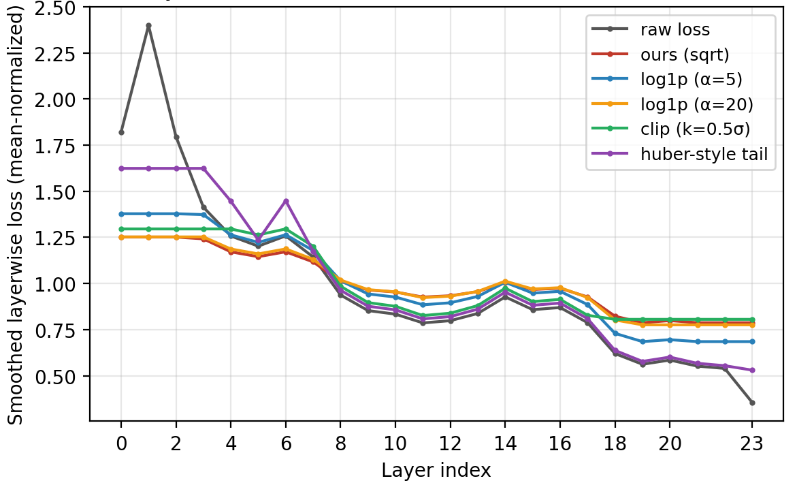

## Additional Tables and Figures for Reviewer bCLh

We appreciate the reviewer’s time and effort in reviewing our work and your patience in reading through the response. Since the OpenReview response mainly reports averaged results and does not support figures, we provide additional experimental details here for reference. 

#### [Weakness 1] Square-root smoothing of layerwise loss lacks justification

> Fig. R1: Smoothed layerwise loss under different monotone concave smoothing functions. 

| Smooth fn       | Setting                | PIQA      | ARC-c     | ARC-e     | BoolQ     | HellaSwag | WinoGrande | GSM8K     | HumanEval | Avg       |
| --------------- | ---------------------- | --------- | --------- | --------- | --------- | --------- | ---------- | --------- | --------- | --------- |
| NA              | -                      | 72.06     | 34.73     | 54.29     | 70.46     | 58.48     | 64.07      | 46.82     | 18.29     | 52.40     |
| Log             | $\alpha=5$             | 74.85     | 32.34     | 60.88     | 68.66     | 61.07     | 68.86      | 56.40     | 32.32     | 56.92     |
| Huber           | $\delta=\mu+0.5\sigma$ | 73.45     | 32.14     | 56.89     | 67.66     | 61.65     | 69.86      | 56.40     | 29.27     | 55.92     |
| Clip            | $k=0.5$                | 74.45     | 35.33     | 59.88     | 68.66     | 62.08     | 68.66      | 55.80     | 28.66     | 56.69     |
| **Sqrt (ours)** | **-**                  | **74.45** | **35.93** | **66.07** | **70.46** | **61.28** | **69.26**  | **58.24** | **30.50** | **58.27** |

> Tab. R4: Downstream performance obtained using channel allocations derived from different smoothed layerwise loss functions. 

