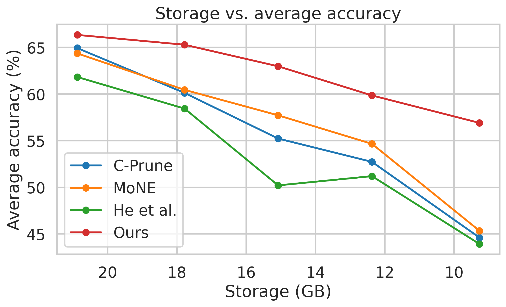

## Additional Tab.s and Figures for Reviewer fDBp

We appreciate the reviewer’s time and effort in reviewing our work and your patience in reading through the response. Since the OpenReview response mainly reports averaged results and does not support figures, we provide additional experimental details here for reference. 

#### [Weakness 1 / Question 1] First-order Taylor approximation may incur non-negligible errors, and comparison with second-order estimates is missing

The first order score is

$$
s_e^{(1)} = \left[ -\left.\frac{\partial \mathcal{L}_e(\alpha_e)}{\partial \alpha_e}\right|_{\alpha_e=1}\right]_+
$$

The second-order score is

$$
s_e^{(2)}=
\left[
-\left.\frac{\partial \mathcal{L}_e(\alpha_e)}{\partial \alpha_e}\right|_{\alpha_e=1}
+\frac{1}{2}
\left.\frac{\partial^2 \mathcal{L}_e(\alpha_e)}{\partial \alpha_e^2}\right|_{\alpha_e=1}
\right]_+
$$

The true local perturbation loss as the exact local loss change caused by directly removing expert $e$  (i.e., let $\alpha_e=0$ in $\mathcal L_e(\alpha_e)$): 

$$
s_e^{(\mathrm{true})}
=
\mathcal{L}_e(0)-\mathcal{L}_e(1)
$$

| Metric                               | Time per layer per batch (s) | Total Time (h) |
| ------------------------------------ | ---------------------------- | -------------- |
| First-order $s_e^{(1)}$              | 0.159                        | 1.54           |
| Second-order $s_e^{(2)}$             | 2.686                        | 26.02          |
| True ablated $s_e^{(\mathrm{true})}$ | 2.392                        | 23.17          |

> Tab. R7: Computation time of the first-order score, the exact second-order score, and the true ablated score on Qwen1.5-MoE-A2.7B. 

| Metric                   | PIQA  | ARC-c | ARC-e | BoolQ | HellaSwag | Winogrande | GSM8K | MMLU  | Avg   |
| ------------------------ | ----- | ----- | ----- | ----- | --------- | ---------- | ----- | ----- | ----- |
| First-order $s_e^{(1)}$  | 74.45 | 35.93 | 66.07 | 70.46 | 61.28     | 69.26      | 58.24 | 51.43 | 60.89 |
| Second-order $s_e^{(2)}$ | 78.04 | 36.13 | 64.67 | 76.45 | 61.30     | 70.26      | 56.49 | 53.40 | 62.09 |

> Tab. R8: End-to-end downstream accuracy using allocation results derived from the first-order and exact second-order scores, without retraining or fine-tuning. 

#### [Weakness 2] Inconsistency between Tab. 3 and Tab. 5

| Model             | Setting       | Method    | ARC-c     | ARC-e     | HellaSwag | PIQA      | BoolQ     | WinoGrande | MMLU      | Avg       |
| ----------------- | ------------- | --------- | --------- | --------- | --------- | --------- | --------- | ---------- | --------- | --------- |
| Qwen1.5-MoE-A2.7B | 0%            | Baseline  | 40.41     | 69.44     | 77.17     | 80.79     | 79.57     | 69.77      | 61.08     | 68.32     |
|                   | 50%           | MoNE      | 32.17     | 64.81     | 43.52     | 70.13     | 69.05     | 63.61      | 45.67     | 55.57     |
|                   | 50%           | He et al. | 26.96     | 42.21     | 45.46     | 68.23     | 63.55     | 53.35      | 31.52     | 47.33     |
|                   | **50%**       | **Ours**  | **40.53** | **70.45** | **73.11** | **77.04** | **78.93** | **65.27**  | **50.67** | **65.14** |
|                   | 25%           | MoNE      | 42.15     | 75.34     | 54.47     | 77.47     | 74.86     | 72.10      | 56.19     | 64.65     |
|                   | 25%, 4bit     | He et al. | 38.91     | 60.69     | 71.22     | 77.91     | 68.41     | 63.85      | 52.73     | 61.96     |
|                   | **25%, 4bit** | **Ours**  | **45.13** | **73.19** | **75.01** | **79.00** | **84.22** | **68.67**  | **58.29** | **69.07** |
| DeepSeek-MoE-16B  | 0%            | Baseline  | 46.93     | 78.37     | 77.98     | 80.20     | 79.82     | 71.35      | 45.58     | 68.60     |
|                   | 50%           | MoNE      | 22.53     | 24.58     | 25.57     | 49.51     | 37.83     | 49.57      | 23.12     | 33.24     |
|                   | 50%           | He et al. | 28.67     | 41.41     | 53.67     | 68.17     | 38.65     | 55.17      | 23.47     | 44.17     |
|                   | **50%**       | **Ours**  | **42.49** | **73.78** | **74.59** | **78.40** | **71.77** | **69.22**  | **44.16** | **64.92** |
|                   | 25%           | MoNE      | 22.70     | 25.08     | 25.89     | 53.37     | 37.83     | 49.57      | 23.12     | 33.94     |
|                   | 25%, 4bit     | He et al. | 44.0      | 70.75     | 74.5      | 78.5      | 66.0      | 67.3       | 27.9      | 59.7      |
|                   | **25%, 4bit** | **Ours**  | **47.61** | **76.35** | **76.25** | **79.54** | **75.29** | **69.30**  | **48.91** | **67.61** |
| DeepSeek-V2-Lite  | 0%            | Baseline  | 46.93     | 78.37     | 77.98     | 80.2      | 79.82     | 71.35      | 45.58     | 68.6      |
|                   | 50%           | He et al. | 33.15     | 58.92     | 57.84     | 78.2      | 50.45     | 62.52      | 36.05     | 53.88     |
|                   | 50%           | C-Prune   | 24.4      | 35.65     | 41.14     | 58.92     | 55.87     | 51.22      | 29.52     | 42.39     |
|                   | **50%**       | **Ours**  | **42.49** | **73.78** | **74.59** | **78.40** | **71.77** | **69.22**  | **44.16** | **58.67** |
|                   | 25%, 4bit     | He et al. | 44.86     | 73.51     | 63.78     | 81.08     | 68.65     | 66.85      | 49.03     | 63.97     |
|                   | 25%, 4bit     | C-Prune   | 41.72     | 72.81     | 53.53     | 77.86     | 70.98     | 67.8       | 47.97     | 61.81     |
|                   | **25%, 4bit** | **Ours**  | **47.61** | **76.35** | **76.25** | **79.54** | **75.29** | **69.3**   | **48.91** | **67.61** |

> Tab. R9: Additional reproduced results of publicly available baseline methods on Qwen and DeepSeek MoE models. 

#### [Question 2] Some methods omitted from quantization evaluation

| Model             | Setting       | Method   | Storage (GB) | ARC-c     | ARC-e     | HellaSwag | PIQA      | BoolQ     | WinoGrande | MMLU      | Avg       |
| ----------------- | ------------- | -------- | ------------ | --------- | --------- | --------- | --------- | --------- | ---------- | --------- | --------- |
| Qwen1.5-MoE-A2.7B | 0%            | Baseline | 28.7         | 40.41     | 69.44     | 77.17     | 80.79     | 79.57     | 69.77      | 61.08     | 68.32     |
|                   | 25%, 4bit     | Wanda    | 7.1          | 41.64     | 69.74     | 76.48     | 79.38     | 79.36     | 69.22      | 60.34     | 68.02     |
|                   | 25%, 4bit     | MoNE     | 5.6          | 40.36     | 59.1      | 63.06     | 81.44     | 69.37     | 66.49      | 55.39     | 62.17     |
|                   | 25%, 4bit     | C-Prune  | 5.6          | 40.0      | 62.7      | 63.06     | 78.92     | 77.12     | 67.75      | 56.68     | 63.75     |
|                   | **25%, 4bit** | **Ours** | **5.6**      | **45.13** | **73.19** | **75.01** | **79**    | **84.22** | **68.67**  | **58.29** | **69.07** |
| DeepSeek-V2-Lite  | 0%            | Baseline | 31.41        | 46.93     | 78.37     | 77.98     | 80.2      | 79.82     | 71.35      | 45.58     | 68.6      |
|                   | 25%, 4bit     | Wanda    | 7.7          | 46.59     | 76.64     | 77.12     | 79.38     | 78.99     | 71.74      | 53.94     | 69.2      |
|                   | 25%, 4bit     | MoNE     | 6.0          | 44.86     | 73.51     | 63.78     | 81.08     | 68.65     | 66.85      | 49.03     | 63.97     |
|                   | 25%, 4bit     | C-Prune  | 6.0          | 41.72     | 72.81     | 53.53     | 77.86     | 70.98     | 67.8       | 47.97     | 61.81     |
|                   | **25%, 4bit** | **Ours** | **6.0**      | **47.61** | **76.35** | **76.25** | **79.54** | **75.29** | **69.3**   | **48.91** | **67.61** |

> Tab. R10: Additional quantized baseline results under the same bitsandbytes NF4 quantization setting. 

####  [Question 3] Channel-level vs. expert-level comparison at same compression ratios

> Fig. R1: Pareto frontier of average downstream-task accuracy versus compressed model storage (GB). 

| **Method** | **Expert-Level Pruning** | **Prune ratio** % | **Storage (GB)** | **ARC-c** | **ARC-e** | **HellaSwag** | **PIQA**  | **BoolQ** | **WinoGrande** | **Avg**   |
| ---------- | ------------------------ | ----------------- | ---------------- | --------- | --------- | ------------- | --------- | --------- | -------------- | --------- |
| C-Prune    | $\checkmark$             | 25%               | 20.88            | 40        | 62.7      | 63.06         | 78.92     | 77.12     | 67.75          | 64.93     |
| MoNE       | $\checkmark$             | 25%               | 20.88            | 40.44     | 60.73     | 64.14         | 81.2      | 71.53     | 68.11          | 64.36     |
| He et al.  | $\checkmark$             | 25%               | 20.88            | 37.3      | 59.64     | 61.8          | 81.08     | 67.93     | 63.24          | 61.83     |
| **Ours**   | **$\times$**             | **25%**           | **20.88**        | **42.16** | **65.41** | **63.24**     | **79.1**  | **78.2**  | **69.91**      | **66.34** |
| C-Prune    | $\checkmark$             | 38.3%             | 17.78            | 34.59     | 58.02     | 60.72         | 76.22     | 69.55     | 61.62          | 60.12     |
| MoNE       | $\checkmark$             | 38.3%             | 17.78            | 35.5      | 52.61     | 64.32         | 80.36     | 64.5      | 65.41          | 60.45     |
| He et al.  | $\checkmark$             | 38.3%             | 17.78            | 34.41     | 55.86     | 58.74         | 77.12     | 64.86     | 59.64          | 58.44     |
| **Ours**   | **$\times$**             | **38.3%**         | **17.78**        | **40.72** | **64.14** | **63.24**     | **78.92** | **75.68** | **69.01**      | **65.29** |
| C-Prune    | $\checkmark$             | 50%               | 15.08            | 30.63     | 50.09     | 57.12         | 74.23     | 62.16     | 57.12          | 55.23     |
| MoNE       | $\checkmark$             | 50%               | 15.08            | 32.07     | 51.71     | 60.54         | 76.58     | 63.6      | 61.8           | 57.72     |
| He et al.  | $\checkmark$             | 50%               | 15.08            | 25.95     | 45.41     | 44.86         | 69.37     | 63.06     | 52.61          | 50.21     |
| **Ours**   | **$\times$**             | **50%**           | **15.08**        | **36.76** | **65.95** | **61.98**     | **75.32** | **69.37** | **68.47**      | **62.98** |
| C-Prune    | $\checkmark$             | 61.7%             | 12.37            | 28.29     | 44.5      | 53.87         | 69.73     | 65.95     | 54.05          | 52.73     |
| MoNE       | $\checkmark$             | 61.7%             | 12.37            | 30.27     | 46.13     | 55.68         | 73.15     | 63.42     | 59.28          | 54.66     |
| He et al.  | $\checkmark$             | 61.7%             | 12.37            | 27.57     | 45.05     | 47.21         | 72.07     | 61.26     | 54.05          | 51.2      |
| **Ours**   | **$\times$**             | **61.7%**         | **12.37**        | **33.15** | **58.2**  | **60**        | **73.87** | **67.39** | **66.49**      | **59.85** |
| C-Prune    | $\checkmark$             | 75%               | 9.27             | 23.42     | 35.32     | 42.52         | 59.46     | 54.41     | 52.61          | 44.62     |
| MoNE       | $\checkmark$             | 75%               | 9.27             | 25.95     | 36.58     | 41.62         | 61.44     | 52.97     | 53.51          | 45.35     |
| He et al.  | $\checkmark$             | 75%               | 9.27             | 21.8      | 36.04     | 37.48         | 60.36     | 54.23     | 53.69          | 43.93     |
| **Ours**   | **$\times$**             | **75%**           | **9.27**         | **32.61** | **52.07** | **56.22**     | **69.37** | **67.57** | **63.6**       | **56.91** |

> Tab. R11: Accuracy comparison of different pruning methods on general QA benchmarks under various compression ratios. 

#### [Question 4] Is P25%Q4b the global optimum? A wider range of P/Q combinations

| P (prune ratio) | Q (bitwidth) | Storage  | PIQA      | ARC-c     | ARC-e     | BoolQ     | HellaSwag | WinoGrande | GSM8K     | HumanEval | Avg       |
| --------------- | ------------ | -------- | --------- | --------- | --------- | --------- | --------- | ---------- | --------- | --------- | --------- |
| 0%              | 16           | 28.7     | 80.79     | 40.41     | 69.44     | 70.57     | 77.17     | 69.77      | 61.5      | 34.2      | 62.98     |
| 15%             | 8            | 13.5     | 80.04     | 41.52     | 65.07     | 77.64     | 65.07     | 70.26      | 61.08     | 31.10     | 61.47     |
| 25%             | 8            | 12.25    | 79.04     | 41.52     | 64.67     | 76.85     | 63.67     | 69.66      | 62.35     | 26.83     | 60.57     |
| 35%             | 8            | 11.01    | 78.24     | 39.32     | 61.68     | 75.25     | 63.87     | 67.47      | 62.28     | 34.15     | 60.28     |
| 45%             | 8            | 9.76     | 76.65     | 39.32     | 64.07     | 72.85     | 62.28     | 69.46      | 62.48     | 34.76     | 60.23     |
| 15%             | 4            | 7.36     | 79.24     | 38.72     | 63.87     | 76.45     | 64.27     | 70.86      | 61.26     | 28.05     | 60.34     |
| **25%**         | **4**        | **6.71** | **79.04** | **40.92** | **60.88** | **76.85** | **63.27** | **69.26**  | **56.24** | **27.44** | **59.24** |
| 35%             | 4            | 6.07     | 78.24     | 37.92     | 62.28     | 77.05     | 62.87     | 70.26      | 56.89     | 31.71     | 59.65     |
| 45%             | 4            | 5.43     | 74.65     | 35.13     | 62.48     | 71.86     | 61.28     | 70.46      | 52.61     | 26.22     | 56.84     |

> Tab. R12: Storage and downstream accuracy under different pruning ratio P and quantization bitwidth Q combinations. 