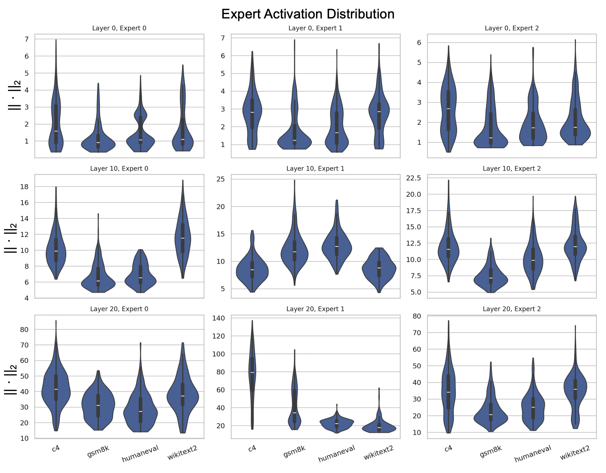

## Additional Tables and Figures for Reviewer qUVM

We appreciate the reviewer’s time and effort in reviewing our work and your patience in reading through the response. Since the OpenReview response mainly reports averaged results and does not support figures, we provide additional experimental details here for reference. 

#### [Question 1] Pareto Frontier plots of performance vs. compression

> Fig. R1: Pareto frontier of average downstream-task accuracy versus compressed model storage (GB). 

| Method    | Expert-Level Pruning | Prune ratio % | Storage (GB) | ARC-c     | ARC-e     | HellaSwag | PIQA      | BoolQ     | WinoGrande | Avg       |
| --------- | -------------------- | ------------- | ------------ | --------- | --------- | --------- | --------- | --------- | ---------- | --------- |
| C-Prune   | $\checkmark$         | 25%           | 20.88        | 40.0      | 62.7      | 63.06     | 78.92     | 77.12     | 67.75      | 64.93     |
| MoNE      | $\checkmark$         | 25%           | 20.88        | 40.44     | 60.73     | 64.14     | 81.2      | 71.53     | 68.11      | 64.36     |
| He et al. | $\checkmark$         | 25%           | 20.88        | 37.3      | 59.64     | 61.8      | 81.08     | 67.93     | 63.24      | 61.83     |
| **Ours**  | **$\times$**         | **25%**       | **20.88**    | **42.16** | **65.41** | **63.24** | **79.1**  | **78.2**  | **69.91**  | **66.34** |
| C-Prune   | $\checkmark$         | 38.3%         | 17.78        | 34.59     | 58.02     | 60.72     | 76.22     | 69.55     | 61.62      | 60.12     |
| MoNE      | $\checkmark$         | 38.3%         | 17.78        | 35.5      | 52.61     | 64.32     | 80.36     | 64.5      | 65.41      | 60.45     |
| He et al. | $\checkmark$         | 38.3%         | 17.78        | 34.41     | 55.86     | 58.74     | 77.12     | 64.86     | 59.64      | 58.44     |
| **Ours**  | **$\times$**         | **38.3%**     | **17.78**    | **40.72** | **64.14** | **63.24** | **78.92** | **75.68** | **69.01**  | **65.29** |
| C-Prune   | $\checkmark$         | 50%           | 15.08        | 30.63     | 50.09     | 57.12     | 74.23     | 62.16     | 57.12      | 55.23     |
| MoNE      | $\checkmark$         | 50%           | 15.08        | 32.07     | 51.71     | 60.54     | 76.58     | 63.6      | 61.8       | 57.72     |
| He et al. | $\checkmark$         | 50%           | 15.08        | 25.95     | 45.41     | 44.86     | 69.37     | 63.06     | 52.61      | 50.21     |
| **Ours**  | **$\times$**         | **50%**       | **15.08**    | **36.76** | **65.95** | **61.98** | **75.32** | **69.37** | **68.47**  | **62.98** |
| C-Prune   | $\checkmark$         | 61.7%         | 12.37        | 28.29     | 44.5      | 53.87     | 69.73     | 65.95     | 54.05      | 52.73     |
| MoNE      | $\checkmark$         | 61.7%         | 12.37        | 30.27     | 46.13     | 55.68     | 73.15     | 63.42     | 59.28      | 54.66     |
| He et al. | $\checkmark$         | 61.7%         | 12.37        | 27.57     | 45.05     | 47.21     | 72.07     | 61.26     | 54.05      | 51.2      |
| **Ours**  | **$\times$**         | **61.7%**     | **12.37**    | **33.15** | **58.2**  | **60.0**  | **73.87** | **67.39** | **66.49**  | **59.85** |
| C-Prune   | $\checkmark$         | 75%           | 9.27         | 23.42     | 35.32     | 42.52     | 59.46     | 54.41     | 52.61      | 44.62     |
| MoNE      | $\checkmark$         | 75%           | 9.27         | 25.95     | 36.58     | 41.62     | 61.44     | 52.97     | 53.51      | 45.35     |
| He et al. | $\checkmark$         | 75%           | 9.27         | 21.8      | 36.04     | 37.48     | 60.36     | 54.23     | 53.69      | 43.93     |
| **Ours**  | **$\times$**         | **75%**       | **9.27**     | **32.61** | **52.07** | **56.22** | **69.37** | **67.57** | **63.6**   | **56.91** |

> Tab. R5: Accuracy comparison of different pruning methods on general QA benchmarks under various compression ratios. Our method performs channel-level structural pruning, whereas the competing baselines adopt expert-level pruning. 

#### [Limitation 1] Robustness under different routing dynamics or expert heterogeneity

> Fig. R2: Router entropy distributions across different tasks, layer depths, and MoE models. 

| Model         | Top-k | Prune ratio% | PIQA | ARC-c | ARC-e | BoolQ | HellaSwag | WinoGrande | GSM8K | HumanEval | Avg |
| ----------------- | ------------ | ------ | -------- | ----------------- | ------------ | --------- | ------------- | -------------- | --------- | -------------- | ----------------- |
| Qwen1.5-MoE-A2.7B |   2            | 0%     | 83.03    | 42.12             | 65.27        | 77.45     | 64.87         | 65.07          | 52.5      | 34.15          | 62.98 |
|                   | 2            | 50%    | 72.65    | 35.13             | 63.27        | 66.67     | 60.28         | 67.66          | 50.5      | 25             | 58.27 |
|                   | 1            | 0%     | 79.24    | 40.12             | 66.87        | 69.26     | 61.08         | 65.07          | 36.93     | 20.12          | 60.56 |
|                   | 1            | 50%    | 71.86    | 33.53             | 59.28        | 66.07     | 56.09         | 63.07          | 29.74     | 21.34          | 55.15 |
| DS-V2-Lite | 2            | 0%     | 79.45    | 42.66             | 68.30        | 75.15     | 62.82         | 65.56          | 25.64     | 25.61          | 54.84 |
|                   | 2            | 50%    | 75.34    | 35.42             | 61.25        | 65.36     | 57.34         | 63.01          | 24.85     | 18.29          | 50.12 |
|                   | 1            | 0%     | 73.65    | 33.53             | 61.88        | 65.07     | 54.69         | 60.68          | 6.39      | 10.98          | 62.23 |
|                   | 1            | 50%    | 71.06    | 29.74             | 56.49        | 61.48     | 52.89         | 57.29          | 8.38      | 7.93           | 59.08 |

> Tab. R6: Evaluation results under Top-1 and Top-2 routing policies for different pruning ratios and MoE architectures. 

> Fig. R3: Distribution of expert activation magnitudes across representative shallow, middle, and deep layers of Qwen1.5-MoE-A2.7B under different calibration corpora. 

#### [Limitation 2] The first-order approximation may introduce estimation error

The first order score is

$$
s_e^{(1)} = \left[ -\left.\frac{\partial \mathcal{L}_e(\alpha_e)}{\partial \alpha_e}\right|_{\alpha_e=1}\right]_+
$$

The second-order score is

$$
s_e^{(2)}=
\left[
-\left.\frac{\partial \mathcal{L}_e(\alpha_e)}{\partial \alpha_e}\right|_{\alpha_e=1}
+\frac{1}{2}
\left.\frac{\partial^2 \mathcal{L}_e(\alpha_e)}{\partial \alpha_e^2}\right|_{\alpha_e=1}
\right]_+
$$

The true local perturbation loss as the exact local loss change caused by directly removing expert $e$  (i.e., let $\alpha_e=0$ in $\mathcal L_e(\alpha_e)$): 

$$
s_e^{(\mathrm{true})}
=
\mathcal{L}_e(0)-\mathcal{L}_e(1)
$$

| Metric                               | Time per layer per batch (s) | Total Time (h) |
| ------------------------------------ | ---------------------------- | -------------- |
| First-order $s_e^{(1)}$              | 0.159                        | 1.54           |
| Second-order $s_e^{(2)}$             | 2.686                        | 26.02          |
| True ablated $s_e^{(\mathrm{true})}$ | 2.392                        | 23.17          |

> Table R7: Computation time of the first-order score, the exact second-order score, and the true ablated score on Qwen1.5-MoE-A2.7B. 

| Metric                   | PIQA  | ARC-c | ARC-e | BoolQ | HellaSwag | Winogrande | GSM8K | MMLU  | Avg   |
| ------------------------ | ----- | ----- | ----- | ----- | --------- | ---------- | ----- | ----- | ----- |
| First-order $s_e^{(1)}$  | 74.45 | 35.93 | 66.07 | 70.46 | 61.28     | 69.26      | 58.24 | 51.43 | 60.89 |
| Second-order $s_e^{(2)}$ | 78.04 | 36.13 | 64.67 | 76.45 | 61.30     | 70.26      | 56.49 | 53.40 | 62.09 |

> Table R8: End-to-end downstream accuracy using allocation results derived from the first-order and exact second-order scores, without retraining or fine-tuning. 

**References**

[R1] Ilhan F, et al. Resource- Efficient Transformer Pruning for Finetuning of Large Models. Computer Vision and Pattern Recognition. 2024; 

[R2] Singh SP, Alistarh D. WoodFisher: Efficient Second-Order Approximation for Neural Network Compression. Neural Information Processing Systems. 2020;  

[R3] Wei X, et al. Qdrop: Randomly dropping quantization for extremely low-bit post-training quantization. arXiv preprint arXiv:2203.05740. 2022 Mar 11.