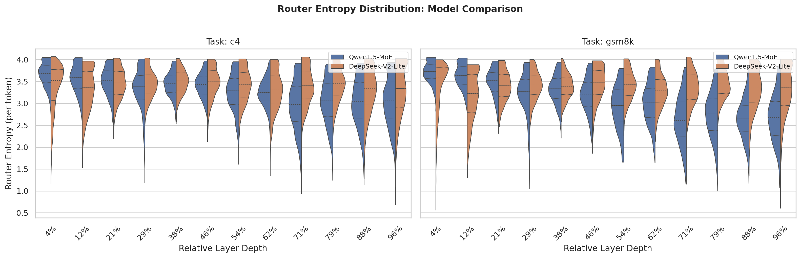

## Additional Derivations, Tables and Figures for Reviewer zn3k

We appreciate the reviewer’s time and effort in reviewing our work and your patience in reading through the response. Since the OpenReview response mainly reports averaged results and does not support figures, we provide additional experimental details here for reference. 

**[Weakness 1 / Question 4] ALA ignores gating values in the first-order loss approximation**

**Derivision.** Specifically, we have defined the MoE output at layer $\ell$ by Eq. (1) in our main text, which is

$$
y_\ell(h_\ell)=\sum_{j\in\mathcal{E}_\ell} g_{\ell,j}(h_\ell)\, z_{\ell,j}(h_\ell),
$$

where

$$
z_{\ell,j}(h_\ell)=f_{\ell,j}(h_\ell)\in\mathbb{R}^{d},
\qquad
g_{\ell,j}(h_\ell)\in\mathbb{R}_{\ge 0}.
$$

For a given input hidden state $h_\ell$, the router output is $g_{\ell,j}(h_\ell)$. To model the removal of expert $e$, we introduce a binary mask variable $m_{\ell,e}\in\{0,1\}$ and rewrite the layer output as

$$
y_\ell(h_\ell; m_{\ell,e})
=
\sum_{j\neq e} g_{\ell,j}(h_\ell)\, z_{\ell,j}(h_\ell)
+
m_{\ell,e}\, g_{\ell,e}(h_\ell)\, z_{\ell,e}(h_\ell).
$$

The original model corresponds to $m_{\ell,e}=1$, while removing expert $e$ corresponds to $m_{\ell,e}=0$. Therefore, the induced output perturbation is

$$
\Delta y_\ell^{(e)}
=
y_\ell(h_\ell;0)-y_\ell(h_\ell;1)
=
-g_{\ell,e}(h_\ell)\, z_{\ell,e}(h_\ell).
$$

Let the local loss be denoted by

$$
\mathcal{L}=\mathcal{L}(y_\ell).
$$

Applying a first-order Taylor expansion around the original output $y_\ell$, we obtain

$$
\Delta \mathcal{L}_\ell^{(e)}
\approx
\left(\frac{\partial \mathcal{L}}{\partial y_\ell}\right)^\top
\Delta y_\ell^{(e)}.
$$

Substituting the perturbation gives

$$
\Delta \mathcal{L}_\ell^{(e)}
\approx
-
\left(\frac{\partial \mathcal{L}}{\partial y_\ell}\right)^\top
\bigl(g_{\ell,e}(h_\ell)\, z_{\ell,e}(h_\ell)\bigr).
$$

Since $g_{\ell,e}(h_\ell)$ is a scalar, and is treated as constant with respect to $z_{\ell,e}$ for fixed $h_\ell$, the Jacobian (the partial derivative) of $y_\ell$ with respect to $z_{\ell,e}$ only acts on the $e$-th term, giving

$$
\frac{\partial y_\ell}{\partial z_{\ell,e}}
=
\frac{\partial \bigl(g_{\ell,e}(h_\ell)\, z_{\ell,e}\bigr)}{\partial z_{\ell,e}}
=
g_{\ell,e}(h_\ell)\,
\frac{\partial z_{\ell,e}}{\partial z_{\ell,e}}
=
g_{\ell,e}(h_\ell)\, \mathbb{I}_d.
$$

where $\mathbb{I}_d \in \mathbb{R}^{d\times d}$ denotes the $d$-dimensional identity matrix. 

By the chain rule,

$$
\frac{\partial \mathcal{L}}{\partial z_{\ell,e}}
=
\left(\frac{\partial y_\ell}{\partial z_{\ell,e}}\right)^\top
\frac{\partial \mathcal{L}}{\partial y_\ell}
=
g_{\ell,e}(h_\ell)\,
\frac{\partial \mathcal{L}}{\partial y_\ell}.
$$

Substituting this into the first-order loss change yields

$$
\Delta \mathcal{L}_\ell^{(e)}
\approx
-
\left(\frac{\partial \mathcal{L}}{\partial z_{\ell,e}}\right)^\top
z_{\ell,e}(h_\ell).
$$

Therefore, although the gate value $g_{\ell,e}(h_\ell)$ does not explicitly appear in the final ALA form, it has already been absorbed into the gradient term $\partial \mathcal{L}/\partial z_{\ell,e}$ through the chain rule. 

Equivalently, if we consider the first-order sensitivity with respect to the masking variable, it can be written as

$$
\frac{\partial \mathcal{L}}{\partial m_{\ell,e}}
=
\left(\frac{\partial \mathcal{L}}{\partial y_\ell}\right)^\top
\frac{\partial y_\ell}{\partial m_{\ell,e}}
=
\left(\frac{\partial \mathcal{L}}{\partial y_\ell}\right)^\top
\bigl(g_{\ell,e}(h_\ell)\, z_{\ell,e}(h_\ell)\bigr),
$$

which again shows that the gate value enters the approximation explicitly. 

#### [Weakness 2 / Question 5] Limited validation of ALA robustness across different MoE routing architectures

> Fig. R1: Router entropy distributions across different tasks, layer depths, and MoE models evaluated in the main text. 

| Model             | Top-k | Prune ratio% | PIQA  | ARC-c | ARC-e | BoolQ | HellaSwag | WinoGrande | GSM8K | HumanEval | Avg   |
| ----------------- | ----- | ------------ | ----- | ----- | ----- | ----- | --------- | ---------- | ----- | --------- | ----- |
| Qwen1.5-MoE-A2.7B | 2     | 0%           | 83.03 | 42.12 | 65.27 | 77.45 | 64.87     | 65.07      | 52.5  | 34.15     | 62.98 |
|                   | 2     | 50%          | 72.65 | 35.13 | 63.27 | 66.67 | 60.28     | 67.66      | 50.5  | 25        | 58.27 |
|                   | 1     | 0%           | 79.24 | 40.12 | 66.87 | 69.26 | 61.08     | 65.07      | 36.93 | 20.12     | 60.56 |
|                   | 1     | 50%          | 71.86 | 33.53 | 59.28 | 66.07 | 56.09     | 63.07      | 29.74 | 21.34     | 55.15 |
| Deepseek-V2-Lite  | 2     | 0%           | 79.45 | 42.66 | 68.30 | 75.15 | 62.82     | 65.56      | 25.64 | 25.61     | 54.84 |
|                   | 2     | 50%          | 75.34 | 35.42 | 61.25 | 65.36 | 57.34     | 63.01      | 24.85 | 18.29     | 50.12 |
|                   | 1     | 0%           | 73.65 | 33.53 | 61.88 | 65.07 | 54.69     | 60.68      | 6.39  | 10.98     | 62.23 |
|                   | 1     | 50%          | 71.06 | 29.74 | 56.49 | 61.48 | 52.89     | 57.29      | 8.38  | 7.93      | 59.08 |

> Tab. R4: Evaluation results under Top-1 and Top-2 routing policies for different pruning ratios and MoE architectures. 

#### [Weakness 2 / Question 3] Key hyperparameters not specified (CBA iterations, minimal channel threshold $m$)

| $m$     | PIQA      | ARC-C     | ARC-E     | BoolQ     | Hellaswag | GSM8K     | HumanEval | Winogrande | Avg       |
| ------- | --------- | --------- | --------- | --------- | --------- | --------- | --------- | ---------- | --------- |
| 64      | 78.44     | 40.52     | 63.67     | 77.25     | 63.17     | 54.29     | 27.44     | 67.66      | 59.06     |
| **128** | **78.72** | **41.51** | **63.48** | **77.12** | **63.62** | **56.88** | **26.83** | **68.16**  | **59.54** |
| 256     | 78.64     | 41.32     | 63.87     | 77.25     | 63.47     | 56.69     | 26.83     | 68.26      | 59.54     |
| 512     | 79.04     | 39.72     | 63.07     | 77.45     | 63.67     | 55.49     | 26.22     | 68.46      | 59.14     |

> Table R5: Ablation study on $m$ for Qwen1.5-MoE-A2.7B under 25% pruning ratio and 4-bit quantization.  

#### [Weakness 3 / Question 5] AAR residual block reallocation strategy lacks theoretical support

| Metric                     | $a$  | GSM8K | HumanEval | PIQA  | ARC-C | ARC-E | BoolQ | Hellaswag | Winogrande | Avg   |
| -------------------------- | ---- | ----- | --------- | ----- | ----- | ----- | ----- | --------- | ---------- | ----- |
| *largest removed channels* | 64   | 56.29 | 26.83     | 78.44 | 40.52 | 63.67 | 77.25 | 63.17     | 67.66      | 59.23 |
| *largest removed channels* | 128  | 56.29 | 27.44     | 78.72 | 41.51 | 63.48 | 77.12 | 63.62     | 68.16      | 59.54 |
| *largest removed channels* | 256  | 57.29 | 24.39     | 78.64 | 41.32 | 63.87 | 77.25 | 63.47     | 68.26      | 59.31 |
| *largest removed scores*   | 64   | 54.69 | 28.05     | 78.04 | 40.72 | 63.67 | 77.45 | 63.47     | 67.47      | 59.2  |
| *largest removed scores*   | 128  | 55.89 | 26.83     | 78.64 | 39.92 | 61.88 | 76.85 | 63.27     | 69.66      | 59.12 |
| *largest removed scores*   | 256  | 56.69 | 24.39     | 79.64 | 41.52 | 66.07 | 75.65 | 64.07     | 71.46      | 59.94 |

> Table R6: Comparison of two reallocation strategies on Qwen1.5-MoE-A2.7B with different alignment block size $a$. 

